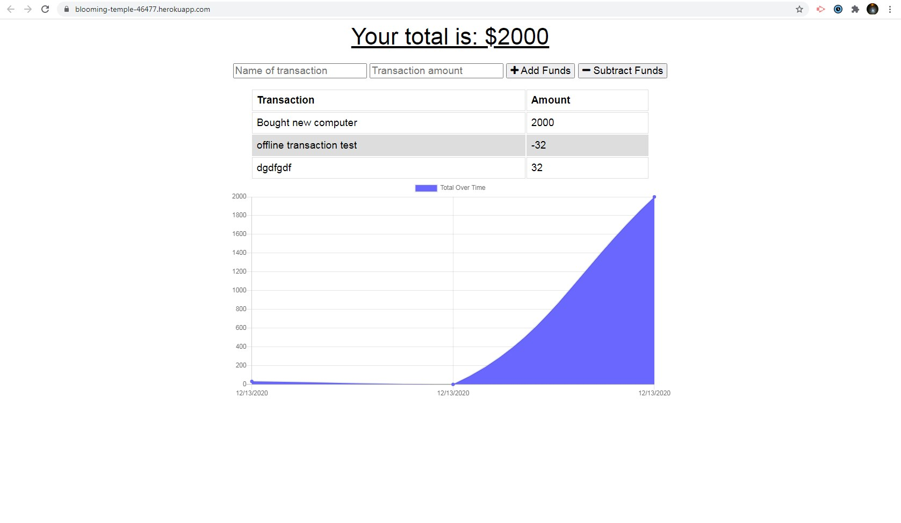
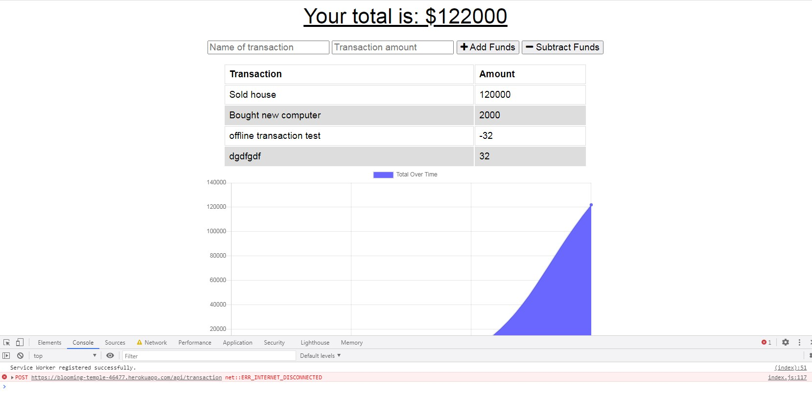
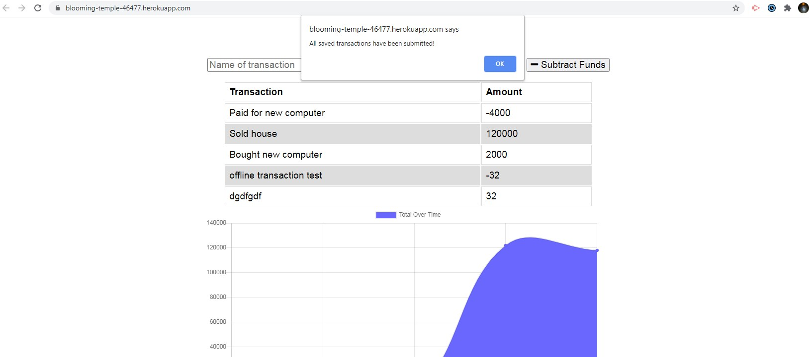

# budget-tracker

## Description

This is a simple application to demonstrate basic understanding of progressive web applications. This application has been coded to work on and offline and data entered during an offline session will be submitted upon re-establishment of a connection. This project is also a functional budget tracker and users can submit deductions and additions to their budget and the data will be persistent.

## Deployed Application
Deployed to Heroku at https://blooming-temple-46477.herokuapp.com/

## Screenshots

## License

This project is covered under a MIT license. Feel free to use it as you wish.

## Questions

  GitHub User Name: willsan0723

  [GitHub Repository](https://github.com/willsan0723/)

  If you have any additional questions you can reach me at william.santee@gmail.com
